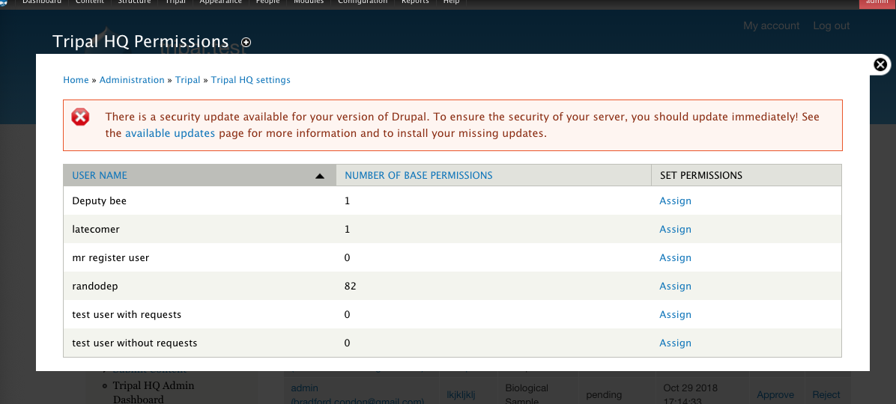
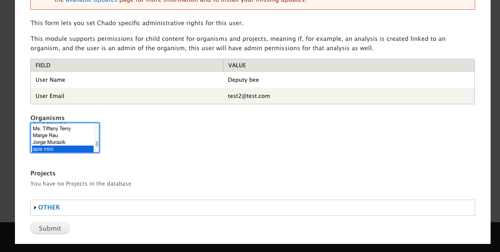
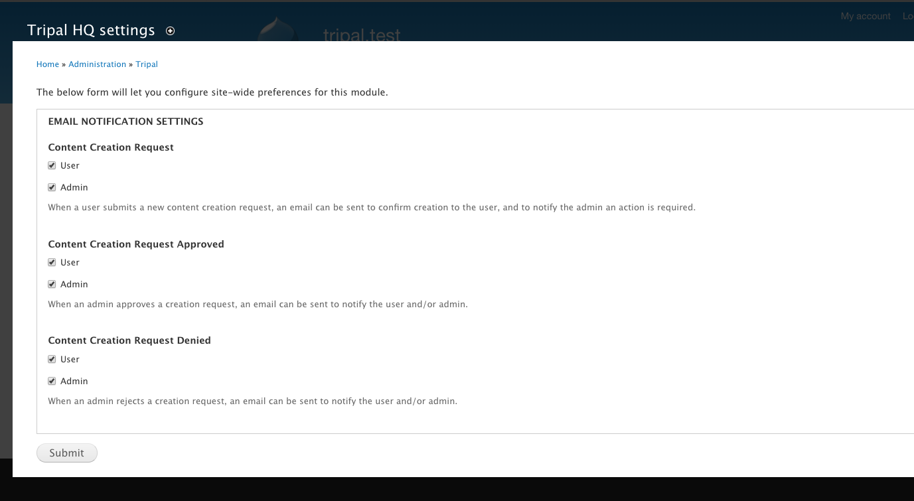
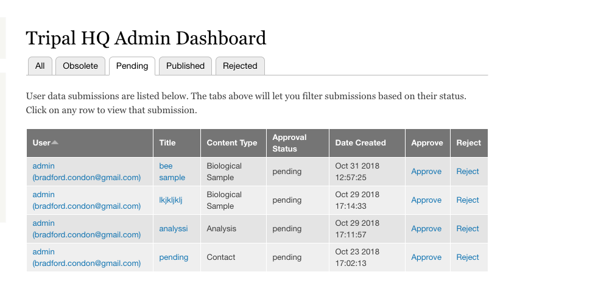

[](https://travis-ci.org/statonlab/tripal_hq)
[](https://zenodo.org/badge/latestdoi/152087832)


# Tripal HeadQuarters (HQ)

Tripal HQ provides an administrative curation toolbox for your Tripal site.  This means that users are able to create whatever Chado content you'd like them, but withhold inserting it into the database until someone has approved it.

HQ also provides a a Chado-specific permission (currently only supporting organisms).  If you have lots of organisms on your site, and want to allow users to be the admin of a specific organism or set of organisms, this feature is for you!

## Module Features

* Users create data using your existing Bundle configuration- no extra forms!
* User dashboard area for viewing pending submissions
* Admin dashboard for viewing submissions
* Chado-based permissions to create admins for certain projects or organisms

# Module installation and setup

Clone the repo with github and enable the module with drush.  For example:

```
cd /var/www/html/sites/all/modules/custom/
git clone https://github.com/statonlab/tripal_hq.git
drush pm-enable tripal_hq tripal_hq_permissions
```


## Permissions set up

On installation, HQ defines the following permissions:

* Administer HQ content:  For Admins to approve/deny content.  Can be combined with the next permission to allow administration of only a subset of requests.
* Administer CHADO-specific tripal_HQ content: Lets you specify what Chado content a user can administer.
* Create Tripal content requests: Allows users to submit content requests and view their dashboard.
* "Propose content" permission for each of your defined bundles.  This will let you configure which bundles can be proposed by users.


To get started, you'll need to create a role for your content submitters, and give them the "Create Content Requests" permission, plus whatever specific bundle permissions you'd like them to see.

For your administrators, you'll want to give them the "Administer HQ content" permission.  If you'd like your admin to only see a subset of content, give them the "Administer CHADO-specific tripal_HQ content" permission and configure their specific permissions (see below).

**Note:** You must create a role for these permissions.  Using the default "Authenticated User" role will **not work**.


### Chado specific Permissions

Chado-specific permissions can be configured at `admin/tripal/tripal_hq/chado_permissions`.  Here you will see all users with the "Administer CHADO-specific tripal_HQ content" permission.  Click "Assign" to give them permission for specific organisms.



Select one or more organism for this user anda click "Submit".



For now, you can only configure organism-based permissions.

## Site-wide Settings

Tripal HQ settings can be found at `admin/tripal/tripal_hq`.  



Here, you can configure what events will contact the user or the admin via email.


# Module Usage

### Users

User content submission can be reached at `tripal_hq/bio_data`. 


Approved, pending, and rejected content is displayed in the table.  CLicking hte View/Edit button will either link to the accepted entity, or to the submission form to submit changes.


 Click the "Submit Content" button to submit Tripal Content.  The submission form is the **exact same form** as the admin content creation form.
 
 ### Admins
 
 The HQ admin dashboard is located at `tripal_hq/admin`.  Admins can click on the tabs to filter submissions based on their status.
 
  
 
 Clicking on the **title** of a pending submission will bring up the edit form, and an admin can make changes to the submission before it is created.
 
 If Chado-specific permissions are set, the admin will only see content on this page related to the organism they are Deputy of.
 
 
 
## Contributing

We're excited to work with you!  Post in the issues queue.

### Development

This module uses [Tripal Test Suite](https://tripaltestsuite.readthedocs.io/en/latest/installation.html#joining-an-existing-project).  It provides a database seeder to make development a bit easier. Once you've installed test suite (`composer install`): run `vendor/bin/tripaltest db:seed` to run all seeders.  This will create fictional users on the site with pending and approved HQ submissions.  **Do not run seeds on a production site**.
